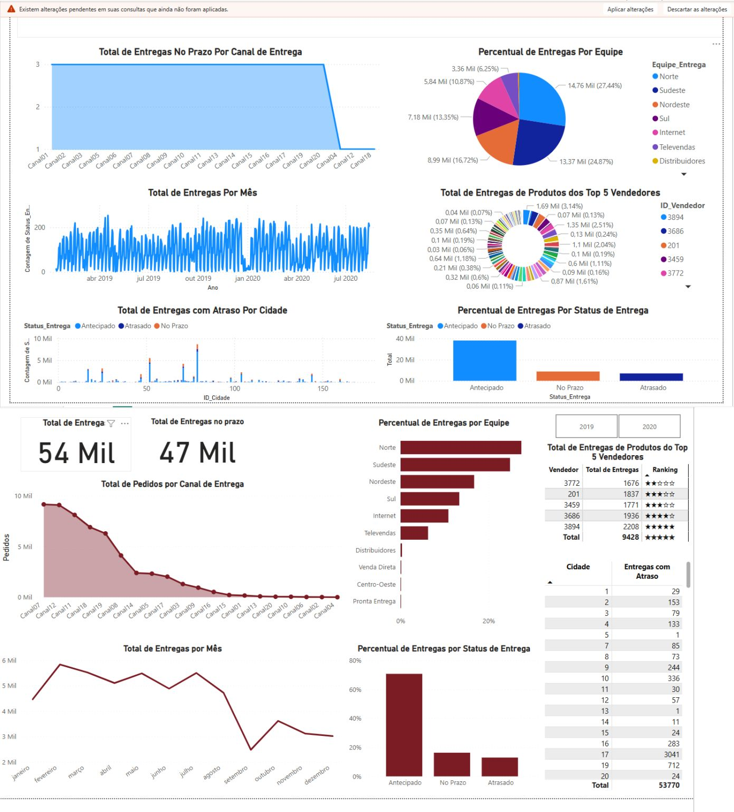

# 📊 Projeto Power BI – Análise de Entregas

Este projeto tem como objetivo analisar a performance de entregas de uma empresa, utilizando ferramentas visuais e KPIs para identificar gargalos, padrões e oportunidades de melhoria.

---

## ✅ Objetivos do Projeto
- Aplicar análise crítica e analítica sobre os dados.
- Corrigir inconsistências na base de dados.
- Utilizar visuais, filtros e KPIs adequados para facilitar a leitura e interpretação.
- Construir um dashboard interativo e informativo com foco em entregas.

---

## 🛠️ Ferramentas Utilizadas
- Power BI
- DAX
- Modelagem de dados

---

## 🔄 Melhorias Realizadas na Versão Atual
- Correção de **erros na base de dados**.
- Ajuste de **gráficos desalinhados com seus propósitos**.
- **Reorganização do layout** do modelo de dados para melhor entendimento.
- Atualização de **medidas DAX** e visuais para fornecer insights mais relevantes.
- **Inclusão de KPIs claros** como:
  - Total de entregas
  - Entregas no prazo
  - Percentual por equipe, status e cidade
- Aplicação de filtros por **ano, cidade, status** e **equipe**, permitindo uma análise segmentada.

---

## 📌 Insights Obtidos
- Equipes e canais com maior índice de atraso.
- Cidades com maior volume de entregas.
- Distribuição por status ao longo do tempo.
- Performance de vendedores e produtos mais relevantes.

---

## 💼 Objetivo Profissional
Este projeto faz parte do meu portfólio como futuro Analista de Dados. Estou em busca de uma oportunidade na área e aberto a conversas com recrutadores e empresas interessadas.

---
